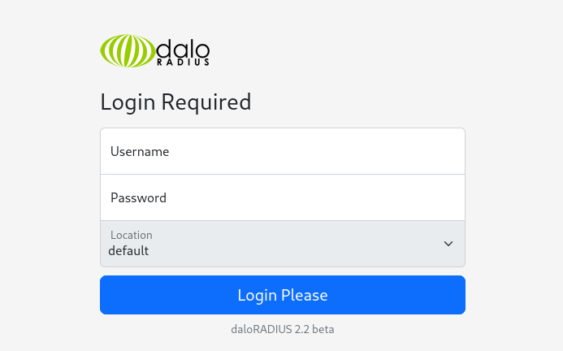

teste

# Diagram

## 1. Information Gathering

### Port Scan
---

- `nmap -v -sS -sU -T3 underpass.htb`

    `-sS` varredura tcp (padrão)

    `-sU` varredura udp (não padrão)

    `-T3` diminui a quantidade de requisições, para driblar ferramentas que dificultam o mapeamento. T0 mais lento, T5 mais rápido

- Resultado

- Portas encontradas:

    `22,80,161,1812,1813,19625,19683,21131,42508,49161`

`nmap -p22,80,161,1812,1813,19625,19683,21131,42508,49161 -sV underpass.htb`

## 2.Enumeration

### HTTP 80

---

- Num primeiro momento, podemos apenas encontrar a página do apache.

    

- Em uma tentativa aleatória de diretórios, obtivemos o erro do servidor retornando a versão do servidor: 

    

- Não foi possível encontrar nenhum arquivo durante a enumeração de diretórios web em um primeiro momento.

    

### SNMP 161:

Resultado

`snmpwalk -v1 -c public 10.10.11.48`

    iso.3.6.1.2.1.1.1.0 = STRING: "Linux underpass 5.15.0-126-generic #136-Ubuntu SMP Wed Nov 6 10:38:22 UTC 2024 x86_64"
    iso.3.6.1.2.1.1.2.0 = OID: iso.3.6.1.4.1.8072.3.2.10
    iso.3.6.1.2.1.1.3.0 = Timeticks: (723282) 2:00:32.82
    iso.3.6.1.2.1.1.4.0 = STRING: "steve@underpass.htb"
    iso.3.6.1.2.1.1.5.0 = STRING: "UnDerPass.htb is the only daloradius server in the basin!"
    iso.3.6.1.2.1.1.6.0 = STRING: "Nevada, U.S.A. but not Vegas"
    iso.3.6.1.2.1.1.7.0 = INTEGER: 72
    iso.3.6.1.2.1.1.8.0 = Timeticks: (1) 0:00:00.01
    iso.3.6.1.2.1.1.9.1.2.1 = OID: iso.3.6.1.6.3.10.3.1.1
    iso.3.6.1.2.1.1.9.1.2.2 = OID: iso.3.6.1.6.3.11.3.1.1
    iso.3.6.1.2.1.1.9.1.2.3 = OID: iso.3.6.1.6.3.15.2.1.1
    iso.3.6.1.2.1.1.9.1.2.4 = OID: iso.3.6.1.6.3.1
    iso.3.6.1.2.1.1.9.1.2.5 = OID: iso.3.6.1.6.3.16.2.2.1
    iso.3.6.1.2.1.1.9.1.2.6 = OID: iso.3.6.1.2.1.49
    iso.3.6.1.2.1.1.9.1.2.7 = OID: iso.3.6.1.2.1.50
    iso.3.6.1.2.1.1.9.1.2.8 = OID: iso.3.6.1.2.1.4
    iso.3.6.1.2.1.1.9.1.2.9 = OID: iso.3.6.1.6.3.13.3.1.3
    iso.3.6.1.2.1.1.9.1.2.10 = OID: iso.3.6.1.2.1.92
    iso.3.6.1.2.1.1.9.1.3.1 = STRING: "The SNMP Management Architecture MIB."
    iso.3.6.1.2.1.1.9.1.3.2 = STRING: "The MIB for Message Processing and Dispatching."
    iso.3.6.1.2.1.1.9.1.3.3 = STRING: "The management information definitions for the SNMP User-based Security Model."
    iso.3.6.1.2.1.1.9.1.3.4 = STRING: "The MIB module for SNMPv2 entities"
    iso.3.6.1.2.1.1.9.1.3.5 = STRING: "View-based Access Control Model for SNMP."
    iso.3.6.1.2.1.1.9.1.3.6 = STRING: "The MIB module for managing TCP implementations"
    iso.3.6.1.2.1.1.9.1.3.7 = STRING: "The MIB module for managing UDP implementations"
    iso.3.6.1.2.1.1.9.1.3.8 = STRING: "The MIB module for managing IP and ICMP implementations"
    iso.3.6.1.2.1.1.9.1.3.9 = STRING: "The MIB modules for managing SNMP Notification, plus filtering."
    iso.3.6.1.2.1.1.9.1.3.10 = STRING: "The MIB module for logging SNMP Notifications."
    iso.3.6.1.2.1.1.9.1.4.1 = Timeticks: (0) 0:00:00.00
    iso.3.6.1.2.1.1.9.1.4.2 = Timeticks: (0) 0:00:00.00
    iso.3.6.1.2.1.1.9.1.4.3 = Timeticks: (0) 0:00:00.00
    iso.3.6.1.2.1.1.9.1.4.4 = Timeticks: (0) 0:00:00.00
    iso.3.6.1.2.1.1.9.1.4.5 = Timeticks: (0) 0:00:00.00
    iso.3.6.1.2.1.1.9.1.4.6 = Timeticks: (0) 0:00:00.00
    iso.3.6.1.2.1.1.9.1.4.7 = Timeticks: (0) 0:00:00.00
    iso.3.6.1.2.1.1.9.1.4.8 = Timeticks: (0) 0:00:00.00
    iso.3.6.1.2.1.1.9.1.4.9 = Timeticks: (1) 0:00:00.01
    iso.3.6.1.2.1.1.9.1.4.10 = Timeticks: (1) 0:00:00.01
    iso.3.6.1.2.1.25.1.1.0 = Timeticks: (725160) 2:00:51.60
    iso.3.6.1.2.1.25.1.2.0 = Hex-STRING: 07 E8 0C 1C 02 08 07 00 2B 00 00 
    iso.3.6.1.2.1.25.1.3.0 = INTEGER: 393216
    iso.3.6.1.2.1.25.1.4.0 = STRING: "BOOT_IMAGE=/vmlinuz-5.15.0-126-generic root=/dev/mapper/ubuntu--vg-ubuntu--lv ro net.ifnames=0 biosdevname=0
    "
    iso.3.6.1.2.1.25.1.5.0 = Gauge32: 0
    iso.3.6.1.2.1.25.1.6.0 = Gauge32: 215
    iso.3.6.1.2.1.25.1.7.0 = INTEGER: 0
    End of MIB
    

mensagem: `"UnDerPass.htb is the only daloradius server in the basin!”`

email: `steve@underpass.htb`

https://github.com/lirantal/daloradius

### O que é Radius ?

O **RADIUS** (*Remote Authentication Dial-In User Service*) é um protocolo de rede que fornece serviços de autenticação, autorização e contabilidade (**AAA**) para gerenciar o acesso de usuários a redes e sistemas. Ele é amplamente usado em ambientes corporativos, ISPs (provedores de internet), redes Wi-Fi, VPNs e outros sistemas que exigem controle centralizado de autenticação.

### O que é daloRADIUS ?

O **daloRADIUS** é um sistema de gerenciamento de RADIUS baseado na web. Ele é um frontend escrito em PHP que permite aos administradores gerenciar servidores **FreeRADIUS**, facilitando tarefas como a configuração de usuários, relatórios e monitoramento. É amplamente utilizado para gerenciar serviços de autenticação, autorização e contabilidade (AAA) em redes que utilizam o protocolo RADIUS.

- Ao tentar acessar o diretório “daloradius” na web, encontramos um diretório, porém sem permissão de acesso.

Pesquisando a aplicação no [https://github.com/daloradius/daloradius](gitihub):

1. Foi encontrado um diretório app.

Ao tentar acessar o diretório, não foi possível acessá-lo.

No diretório `app` temos os seguintes diretórios:

Acessando todos os diretórios, conseguimos um campo de login dentro do diretório `operators.`

Temos uma possível versão do sistema, `2.2 beta`

Depois de algum tempo pesquisando, foi encontrado qual é o login e senha padrão dessa aplicação. Então com o login e senha padrão conseguimos acesso ao servidor:

login: `administrator`

senha: `radius`

Listando usuários.

Foi possível encontrar dois usuários, `mush` e `svcMosh` .

svcMosh:412DD4759978ACFCC81DEAB01B382403

mush:pass123

## 3. Exploitation

convertendo o hash `412DD4759978ACFCC81DEAB01B382403`  no [hashes.com](http://hashes.com) conseguimos a senha `underwaterfriends`

Utilizando o login e senha do usuário svcMosh, foi obtido acesso ao servidor.

R:bb19a462620b5fe443c1eb240bd78664

## 4. Post-Exploitation

Foi executado o [linpeas.sh](http://linpeas.sh) na máquina alvo.

Foi verificado que o usuário corrente poderia utilizar o comando a seguir como root sem a necessidade de usar a senha.  `/usr/bin/mosh-server` 

Logo após foi identificado que poderíamos editar o arquivo no init.d

Foi tentado realizar a execução do programa para entender o seu funcionamento.

1. Foi constatado que é necessário utilizar o parâmetro `new` para criar uma nova versão;
2. Também é necessário utilizar o parâmetro `-p` para definir a porta que será utilizada;
3. Após a execução do comando, a ferramenta irá criar um hash para que seja possível a conexão.

Para realizar a conexão:

1.  É preciso coletar o hash gerado pela operação anterior e armazenar numa variável chamada `MOSH_KEY` ;
2. utilizar a ferramenta `mosh-client` ;
3. Passando como opção o ip do servidor, no caso o `localhost`  e a porta onde será realizada a conexão.

Operação completa:

Shell obtida.

