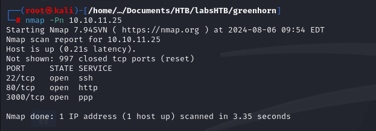
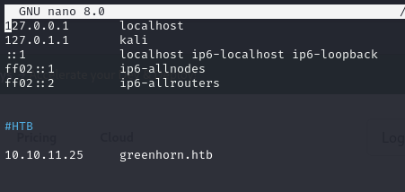

GreenHorn foi uma máquina excelente para treinar as minhas habilidades durante o pentest. Primeiro foi identificado o Pluck CMS. Ao investigar mais a fundo, descobri que na porta 3000 estava disponível o código-fonte do site, contendo credenciais de acesso. Em seguida, explorei uma vulnerabilidade na versão da aplicação, que permitiu um LFI (Local File Inclusion). Com isso, fiz o upload de um arquivo malicioso, o que proporcionou o primeiro acesso ao alvo.

Para escalar privilégios, encontrei um arquivo PDF com credenciais de acesso. Esse arquivo precisou ser "despixelado" para que o conteúdo pudesse ser lido corretamente. Após esse processo, obtive a senha do root, o que possibilitou a escalada de privilégios.

# Diagram

## Information Gathering

### Port Scan
---

- `nmap -Pn 10.10.11.25`
    
    

## Enumeration

### HTTP 80

---

- http://10.10.11.25/
    
    
    
- Há um direcionamento para: greenhorn.htb
    
    

- Edição do `/etc/hosts`
    
    
    
- Acessando a página Web

    
    
- Nome da possível aplicação:
    
    
    

- Ao clicar em "admin" conseguimos entrar no campo de login
    
    

### HTTP 3000    

- Na porta 3000 encontramos uma aplicação Gitea, contendo o versionamento da aplicação (código fonte).

    
    

- Selecionando o botão "Explore" conseguimos encontrar o código fonte da página.
    
    
    
    
- Em `GreenHorn/data/settings` Podemos encontrar informações da aplicação.

    

    $sitetitle = 'GreenHorn';
    $email = 'admin@greenhorn.htb';

- Foi obtido também um hash:

    

        <?php
        $ww = 'd5443aef1b64544f3685bf112f6c405218c573c7279a831b1fe9612e3a4d770486743c5580556c0d838b51749de15530f87fb793afdcc689b6b39024d7790163';
        ?>

- Utilizando o [hashes.com](https://hashes.com) foi possível obter o valor do hash e encontrar a senha para o acesso.

    

## Exploitation

- Utilizando a porta 3000, foi utilizado a credencial encontrada para acessar a conta de admin. 

Foi encontrado uma vuln na versão do sistema pluck 4.7.18 na qual permite o FLI no parâmetro que não realiza a higienização do arquivo que está sendo incluído. 
caminho do parâmetro:`http://greenhorn.htb/admin.php?action=installmodule`

fonte: [fonte: https://github.com/Rai2en/CVE-2023-50564_Pluck-v4.7.18_PoC/blob/main/poc.py](https://github.com/Rai2en/CVE-2023-50564_Pluck-v4.7.18_PoC/blob/main/poc.py)
    

Foi encontrado esse exploit, porém não foi utilizado.

No parâmetro informado (`http://greenhorn.htb/admin.php?action=installmodule`), pudemos encontrar um local para subir arquivos.

- Foi selecionado um reverseshell.php para realizar o upload na aplicação e tentar o shell reverso.

- Após selecionar a aplicação, foi colocado o shell de ataque para ouvir na porta determinada no reverse shell.

    

- Na hora de fazer o upload do arquivo, foi encontrado um erro na execução.

    

Foi constatado que a aplicação só aceita o arquivo .zip.

- Convertendo o shell para .zip:

    

- O upload foi realizado com sucesso.

    

Assim que foi realizado o upload do arquivo, foi obtida a shell inicial do alvo.
Na referencia a qual foi utilizada  para realizar o ataque, pode-se observar um caminho onde possivelmente estaria a shell.

- Não foi possível acessar o conteúdo do host com a conta www-data.
Sendo assim, vamos tentar utilizar a credencial encontrada ( `iloveyou1` ) para acessar o usuário junior.

- Foi obtido sucesso ao acessar a conta.
    

    d4f9ddc90d984468af21edc53b4fd0e5

## Priv Escalation

- Podemos verificar que há um pdf na conta.
    
    
    

- Após realizar o download do arquivo, foi possível observar que o arquivo está pixelado no local da senha.

    

Para despixelar foi utilizado o [https://github.com/spipm/Depix.git](depix.py)

No entando, para utilizar o sistema, precisamos de transforma-lo em png. Para isso foi utilizado o site [https://tools.pdf24.org/en/extract-images?source=post_page-----e87e1cc07864--------------------------------](PDF24 Tools Extract PDF images)

    

Resultado:

    
    sidefromsidetheothersidesidefromsidetheotherside

- Utilizando a credencial encontrada:

    

- Encontrando a flag:

    

    064255efb0e058760e060b915e547f42

